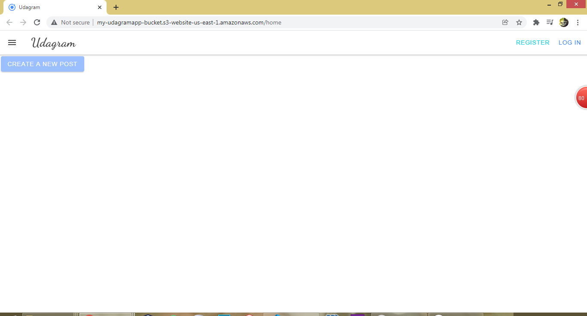

# Udagram

##  **Dependencies:**

- Node v16.13.1 (LTS)
- npm 8.3.2 (LTS)
- AWS CLI v2
- EB (udagram-api/ udagram-api-env)

### Github Repository:

#### [Git Repo](https://github.com/doaaalsheikh/udagramapp)

### Deployed API on Elastic Beanstalk:

#### [Deployed API](http://udagram-api-env.eba-4jmumwps.us-east-1.elasticbeanstalk.com/)
 

### Hosted Frontend on S3 Bucket:

#### [Hosted Forntend](http://my-udagramapp-bucket.s3-website-us-east-1.amazonaws.com/)

