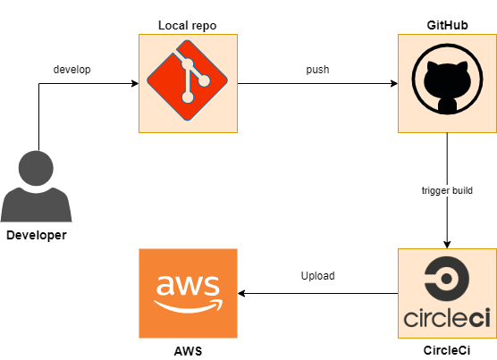
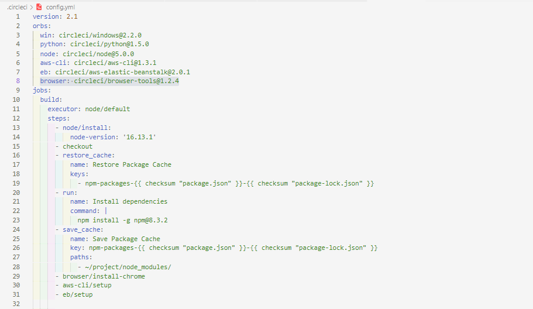
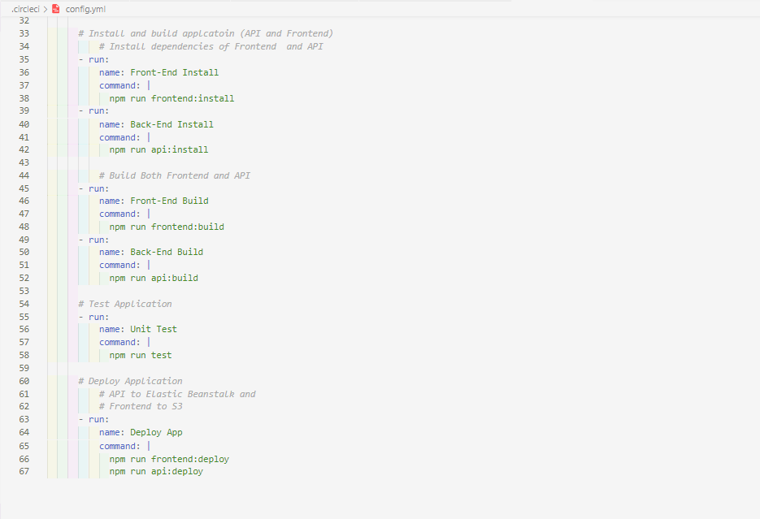
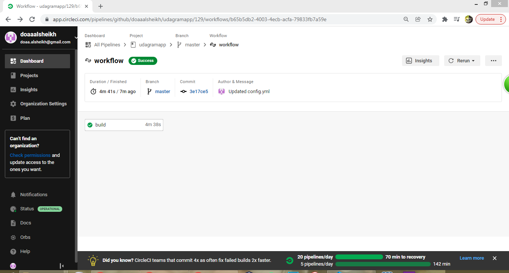
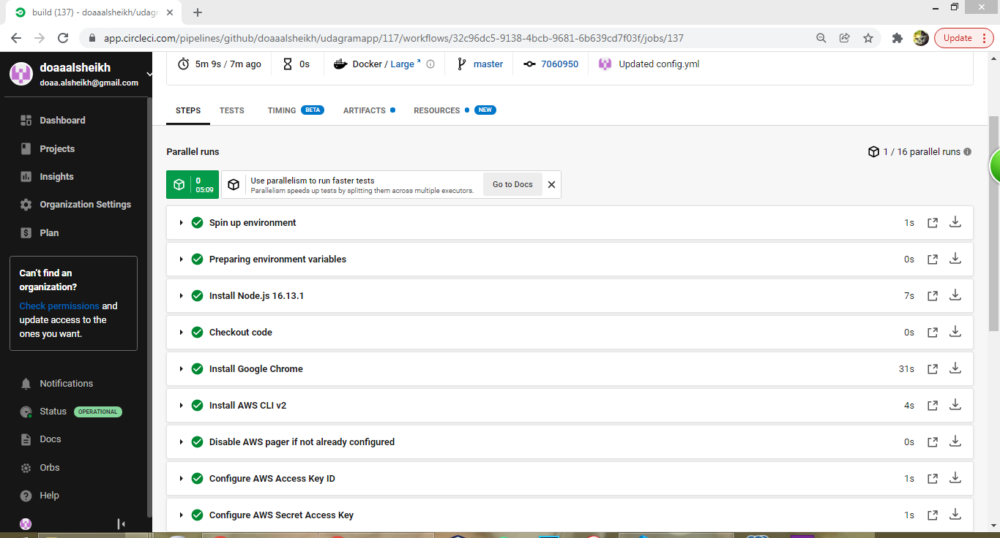
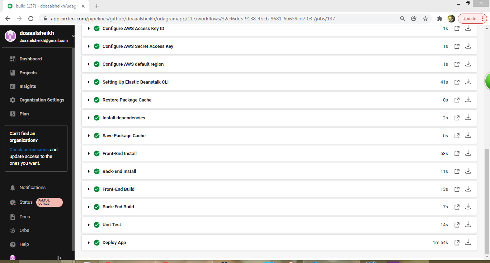
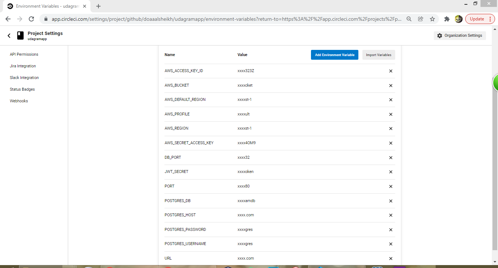

# Udagram

## **Pipeline:**

### Last Success Build status:

1. **Setup the environment (node) and required packages:**
    - Use (node/default) executor
    - Install npm 
    - Restore/ Save cache
    - Install command line of AWS (aws-cli)
    - Install command line of Elastic Beanstalk (eb)
    - Install Chrome browser for Test
2. **Build stage:**
    - Run scripts for Install (API and Frontend)
    - Run scripts for Build (API and Frontend)
3. **Test stage:**
    - Run script for Frontend test
4. **Deploy stage:**
    - Run scripts for Deply API
        #### calling script file (deploy.sh) that contain scripts to deploy and upload api to Elastic Beanstalk and to add environment variables to uploaded api
    - Run scripts for Deply Frontend
        #### calling script file (deploy.sh) that contain script to upload static website contents to be hosted on AWS S3

### CircleCi configuration file:

### Pipeline Process:

